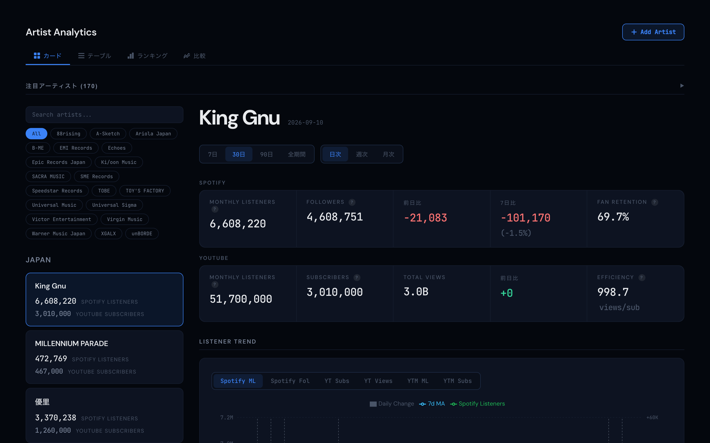

# music-analytics

[](https://github.com/Kosuke-Ito/music-analytics/actions/workflows/test.yml)
[](LICENSE)

Spotify・YouTube・Last.fm からアーティスト指標を日次で自動収集し、Vite + React ダッシュボードで可視化するリポジトリです。GitHub Actions で収集とニュースアノテーションが自動実行されます。

**デモ: https://artist-analytics.pages.dev**



## データソースと取得方法

### Spotify（月間リスナー数 / フォロワー数 / Top Cities）

| 指標 | 取得方法 | 更新頻度 |
|------|----------|----------|
| Monthly Listeners | Playwright で `api-partner.spotify.com` のレスポンスをインターセプト | 日次 |
| Followers | 同上（`stats.followers`） | 日次 |
| Top Cities（上位5都市） | 同上（`stats.topCities`） | 日次 |

**なぜこの方法？**
Spotify 公式 Web API には月間リスナー数のエンドポイントが存在しません。Spotify の Web プレーヤーが内部的に使う Partner API のレスポンスを Playwright（ヘッドレスブラウザ）でインターセプトして取得しています。

**注意点:**
- Spotify がページ構造や API を変更すると壊れる可能性があります
- Top Cities は API が返す上位 5 都市のみ（ページネーション不可）
- ヘッドレスブラウザ検知対策として User-Agent と webdriver フラグを偽装しています

### YouTube（登録者数 / 総再生回数）

| 指標 | 取得方法 | 更新頻度 |
|------|----------|----------|
| Subscribers | YouTube Data API v3 `channels.list` | 日次 |
| Total Views | 同上（`statistics.viewCount`） | 日次 |

**なぜこの方法？**
YouTube Data API は公式に提供されており、API Key のみで利用可能（OAuth 不要）。無料枠で 1 日 10,000 クォータ（1 リクエスト = 1 クォータ）。

**注意点:**
- 登録者数は YouTube 側で丸められた値が返ります（例: 100万以上は万単位）。日次の細かい変動は見えません
- 過去の登録者数履歴は API では取得不可。毎日蓄積して推移を記録しています

**必要な環境変数:** `YOUTUBE_API_KEY`（GitHub Secrets に登録）

### Last.fm（リスナー数 / 累計再生回数）

| 指標 | 取得方法 | 更新頻度 |
|------|----------|----------|
| Listeners | Last.fm API `artist.getInfo` | 日次 |
| Scrobbles（累計再生回数） | 同上（`stats.playcount`） | 日次 |

**なぜこの方法？**
Last.fm はユーザーが Spotify / Apple Music 等を聴いた記録（スクロブル）を蓄積するサービスです。Spotify では取得できない「累計再生回数」が分かります。

**データの特性と偏り:**
- Last.fm をわざわざ連携しているヘビーリスナーのみが対象（カジュアルリスナーは含まれない）
- 欧米・K-pop ファンの利用率が高く、日本のユーザーは少ない
- 単体で「人気度」を測るには偏りが大きいが、Spotify との組み合わせで以下の分析に有用:
  - **scrobbles ÷ listeners = リピート率** — 高いほどコアファンが繰り返し聴いている
  - **Spotify listeners >> Last.fm listeners** なら → カジュアルリスナーが多い（プレイリスト経由）
  - **Last.fm listeners が相対的に多い** → 音楽マニア層に支持されている

**必要な環境変数:** `LASTFM_API_KEY`（GitHub Secrets に登録）

### ニュースアノテーション

| 内容 | 取得方法 | 更新頻度 |
|------|----------|----------|
| アーティスト関連ニュース | Claude Code Action（GitHub Actions）が Web 検索 | 日次 |

**なぜ？**
リスナー数の変動に対して「なぜ増えた / 減ったか」を紐づけるため。新曲リリース、MV 公開、ライブ開催などのイベントをチャート上にマーカーとして表示します。

**必要な環境変数:** `CLAUDE_CODE_OAUTH_TOKEN`（Max プランの OAuth トークン）

## 分析指標

| 指標 | 計算方法 | 意味 |
|------|----------|------|
| Fan Retention | Spotify Followers ÷ Monthly Listeners × 100 | 高いほどコアファンが多い。低いほどプレイリスト経由のカジュアルリスナー中心 |
| YouTube Efficiency | Total Views ÷ Subscribers | 登録者あたりの再生効率。高いほどコンテンツがアクティブに視聴されている |
| Growth Ranking | (今日 - 前日) の絶対値 / (今日 - 7日前) ÷ 7日前 × 100 | 日次・週次の成長率でアーティストをランキング |

## 構成

```
music-analytics/
├── .github/workflows/
│   ├── collect.yml          # 日次データ収集（JST 23:00 / UTC 14:00）
│   ├── annotate.yml         # 日次ニュース収集（JST 23:30 / UTC 14:30）
│   └── investigate-buzz.yml # バズ原因の自動調査（JST 24:00 / UTC 15:00）
├── collector/
│   ├── scraper.py           # Spotify スクレイピング（Playwright）
│   ├── youtube.py           # YouTube Data API v3
│   ├── lastfm.py            # Last.fm API
│   ├── storage.py           # JSON 読み書き・バリデーション
│   ├── main.py              # CLI エントリポイント
│   └── tests/               # pytest テスト
├── scripts/
│   └── config.json          # アーティスト定義（ID, region, live_attendance）
├── data/
│   └── {artist_id}.json     # 蓄積データ（records + annotations）
├── frontend/
│   ├── src/
│   │   ├── components/      # React コンポーネント
│   │   ├── hooks/           # データ取得フック
│   │   ├── utils/           # 分析指標の計算ユーティリティ
│   │   └── types/           # TypeScript 型定義
│   ├── functions/
│   │   └── api/             # Cloudflare Pages Functions（アーティスト追加API等、Basic 認証付き）
│   └── vite.config.ts
├── mcp/                     # MCP サーバー（外部 AI ツールからデータ照会）
├── doc/                     # 競合調査などのドキュメント
└── .mise.toml               # Python 3.12 + Node 20
```

## ローカル開発

```bash
# フロントエンド
cd frontend && pnpm install && pnpm dev
```

`frontend/public/` の `data` と `config.json` はリポジトリルートへのシンボリックリンクです。
Git はシンボリックリンクをそのまま管理するので通常は clone 直後から動きますが、
リンクが実体化してしまう環境（Windows 等）では以下で張り直してください。

```bash
cd frontend/public
ln -sf ../../data data
ln -sf ../../scripts/config.json config.json
```

```bash
# データ収集（全アーティスト）
YOUTUBE_API_KEY=xxx LASTFM_API_KEY=xxx python -m collector.main
```

## テスト

```bash
# Python（collector）
mise exec -- python -m pytest collector/tests -v

# Frontend（Vitest）
cd frontend && pnpm test

# Docker Compose
docker compose run --rm frontend-test
docker compose run --rm collector-test
```

## MCP サーバー（AI ツール連携）

`mcp/` に MCP（Model Context Protocol）サーバーを同梱しています。Claude Code などの MCP クライアントから、蓄積したアーティストデータを直接照会できます。

**提供ツール（5種）:**

| ツール | 内容 |
|--------|------|
| `get_artist_data` | アーティストの全データ（日次レコード・アノテーション・バズ・楽曲統計） |
| `list_artists` | 追跡中アーティスト一覧（region フィルタ可） |
| `get_buzz_events` | バズイベント（annotated / organic / seasonal） |
| `get_annotations` | ニュースアノテーション（release / viral / tour 等） |
| `search_artists` | アーティスト名の部分一致検索 |

**セットアップ:**

```bash
cd mcp && npm install && npm run build
```

**Claude Code への登録例:**

```bash
claude mcp add music-analytics \
  -e MUSIC_ANALYTICS_API_USER=<user> \
  -e MUSIC_ANALYTICS_API_PASS=<pass> \
  -- node /path/to/music-analytics/mcp/dist/index.js
```

登録後は「YOASOBI の直近のバズと原因を教えて」のような自然言語での問い合わせが、MCP ツール経由でデータに基づいて回答されます。API は Basic 認証付きの `/api/*` を利用するため、環境変数に認証情報が必要です。

## 設計判断

- **DB を持たず JSON + Git 管理**: 数十アーティスト × 日次レコード程度ならファイルで十分。インフラコストゼロ・履歴が Git に残る・バックアップ不要。限界が来たら Supabase / Cloudflare D1 等へ段階移行する前提
- **収集は GitHub Actions の無料枠**: サーバーレスの cron として利用。失敗時はワークフローの失敗通知で気づける
- **デモグラフィック分析では勝負しない**: 大手（Soundcharts / Chartmetric 等）が強い領域を避け、「公開シグナル × 日本語ニュース × AI 解釈」の組み合わせに集中
- **AI 連携を将来の柱に**: ダッシュボードで完結させず、MCP / API 経由で外部 AI ツールにデータを渡して戦略相談に使える設計

競合比較の詳細は [doc/competitors.md](doc/competitors.md) を参照してください。

## 収集の挙動

- Spotify 取得は最大 3 回までリトライ
- 月間リスナーが前回比 50% 超の変動は破棄せず保存し、`validation_flags` に `large_monthly_listener_delta` を付与
- 値が 0 以下のときだけ保存をスキップ
- YouTube 登録者数は API の丸め仕様により、大きなアーティストほど変動が見えにくい

## ライセンス・注意

- ライセンスは [MIT](LICENSE) です
- Spotify ページのスクレイピングは利用規約・サイト構造の変更により動かなくなる可能性があります
- YouTube Data API と Last.fm API は各サービスの利用規約に従ってください
- `/api/*`（アーティスト追加などの管理系エンドポイント）は Basic 認証で保護しています。認証情報は Cloudflare Pages の環境変数（Secrets）で管理し、未設定時は fail-closed（503）で拒否します
